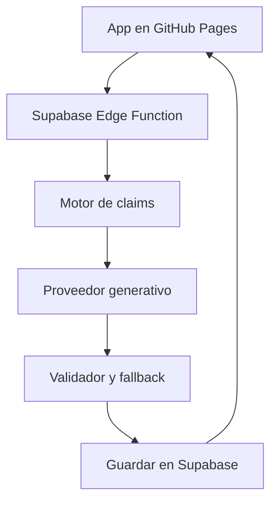

# BRAMU Intelligence e IA generativa

## 1. Recomendación ejecutiva

La opción recomendada es la **3: usar IA generativa como una capa opcional sobre un sistema de reglas**, pero introducirla primero en modo experimental y sin convertirla en una dependencia funcional.

La arquitectura correcta no es:

> datos del partido → modelo generativo → análisis

Debe ser:

> datos registrados → motor determinístico → claims aprobados → modelo generativo → validación → texto guardado

El motor de reglas continúa siendo BRAMU Intelligence. Detecta los hechos, calcula los contextos, determina qué afirmaciones son legítimas, asigna relevancia y conserva la evidencia. El modelo puede aportar naturalidad, combinar dos hechos compatibles y reducir la sensación de plantilla, pero no obtiene permiso para descubrir libremente qué ocurrió.

La IA no debe formar parte de la primera implementación imprescindible. BRAMU Intelligence puede salir con reglas y plantillas y seguir funcionando aunque el proveedor generativo falle, cambie precios o desaparezca. La capa generativa solo debería habilitarse después de superar una prueba comparativa contra las plantillas.

### Decisión recomendada

| Decisión | Recomendación |
|---|---|
| Uso de IA | Sí, como capa opcional y reversible |
| Momento | Después de que el motor de claims funcione correctamente |
| Primera prueba | Modo sombra sobre historias reales anonimizadas |
| Primer proveedor | Cloudflare Workers AI |
| Primer modelo a evaluar | `@cf/qwen/qwen3-30b-a3b-fp8` |
| Plan B | Groq con `openai/gpt-oss-20b` y Zero Data Retention |
| Fuente de verdad | Claims y evidencia calculados por BRAMU |
| Fallback permanente | Plantillas determinísticas |
| Gemini gratuito | No recomendado para producción con datos de usuarios |
| Modelos autoalojados | No recomendados en la etapa inicial |

La razón para no elegir la opción 4 es conceptual, no económica: hacer central a un modelo generativo debilitaría la auditabilidad de un producto cuya promesa exige no hablar como si hubiera observado aquello que no registró.

---

## 2. Qué valor puede aportar realmente un modelo generativo

### 2.1 Lo que las reglas ya pueden resolver bien

El documento de definición de BRAMU Intelligence establece que el producto puede calcular de forma determinística:[^1]

- estructura del resultado;
- rachas y cortes;
- forma de últimos 5 y 10 partidos;
- hitos personales;
- compañeros y rivales habituales;
- balances por relación;
- rarezas del score;
- expectativa previa según Nivel BRAMU;
- confiabilidad y elegibilidad;
- relevancia, deduplicación y cooldowns;
- cantidad adaptativa de insights.

Estas tareas no mejoran por ser delegadas a un modelo. Al contrario: son más comprobables, testeables y consistentes cuando BRAMU las calcula.

La investigación sobre generación de texto desde datos estructurados confirma que la fluidez no garantiza consistencia factual. Incluso en tareas donde la fuente es una tabla o una estructura cerrada, la fidelidad sigue siendo un problema que requiere evaluación específica.[^2]

### 2.2 Dónde sí aparece una ventaja generativa

Un modelo puede mejorar tres aspectos:

1. **Composición:** integrar dos claims compatibles sin que parezcan dos estadísticas pegadas.
2. **Naturalidad:** producir una frase más cercana a la voz de un tercero que conoce la trayectoria.
3. **Variedad controlada:** evitar que jugadores con historias diferentes reciban exactamente la misma estructura verbal.

Ejemplo de dos claims aprobados:

```json
{
  "claim_1": "tercera_victoria_consecutiva",
  "claim_2": "victoria_contra_pareja_0_6_superior",
  "confidence": "alta"
}
```

Plantilla posible:

> Tercera victoria consecutiva. Además, llegó frente a una pareja con mayor Nivel BRAMU promedio.

Redacción generativa válida:

> La racha ya llegó a tres victorias, y esta vez fue ante una pareja que partía por encima en Nivel BRAMU.

El modelo mejora la unión de ideas. No agrega un hecho nuevo.

### 2.3 Lo que no debe delegarse

La IA no debe decidir por sí sola:

- si una secuencia constituye una remontada;
- si un partido fue fácil, difícil o parejo;
- cuál era la expectativa matemática;
- qué compañero “hace jugar mejor” al usuario;
- qué rival es fuerte;
- si existe una tendencia;
- si la muestra es suficiente;
- si un resultado cambia Nivel o Ranking;
- si un insight está autorizado por el modo de registro.

Tampoco debería recibir todo el historial y “buscar algo interesante”. Ese enfoque parece potente, pero elimina el contrato de evidencia y eleva mucho el riesgo de relaciones causales, exageraciones y selecciones inconsistentes.

### 2.4 La naturalidad no alcanza para justificar la complejidad

Un estudio sobre reacciones de usuarios a feedback deportivo generado por IA detectó tensiones entre números y contexto, sesión aislada e historia continua, tono fijo y experiencia personal. Los usuarios pueden rechazar textos fluidos cuando sienten que el sistema se apropia de la interpretación de su experiencia.[^3]

Por lo tanto, el criterio de éxito no debe ser “suena más humano”. Debe ser:

> ¿Cuenta algo más relevante, con menos repetición y la misma precisión factual?

Si la respuesta obtenida en pruebas es no, la capa generativa debe descartarse aunque sea barata.

---

## 3. Comparación de las dos alternativas

| Criterio | A. Reglas y plantillas | B. Sistema híbrido controlado |
|---|---|---|
| Precisión factual | Muy alta y testeable | Alta solo con claims cerrados y validador |
| Auditabilidad | Completa | Completa para claims; parcial para redacción |
| Variedad | Limitada pero controlable | Mayor |
| Naturalidad al combinar hechos | Media | Alta |
| Consistencia de tono | Alta | Requiere pruebas y versionado |
| Repetición longitudinal | Se resuelve con variantes y memoria | Puede reducirla, pero también repetir clichés |
| Costo de inferencia | Cero | Muy bajo, pero variable |
| Latencia | Inmediata | Depende de red y proveedor |
| Privacidad | Datos permanecen en BRAMU | Requiere transferencia a un tercero |
| Dependencia externa | Ninguna | Sí |
| Funcionamiento sin conexión/proveedor | Completo | Necesita fallback |
| Mantenimiento editorial | Más plantillas | Prompts, validadores y benchmark |
| Riesgo de inventar | Bajo | Nunca llega a cero sin control posterior |

### Conclusión comparativa

Las reglas resuelven el valor principal: descubrir qué hecho merece ser contado. La IA resuelve una capa secundaria: cómo contarlo con mayor naturalidad.

Esto justifica una arquitectura híbrida, pero no justifica convertir el modelo en el cerebro de BRAMU Intelligence.

---

## 4. Arquitectura de producto recomendada

### 4.1 Flujo completo

1. El partido se guarda y valida.
2. BRAMU calcula hechos y comparaciones.
3. El motor genera candidatos con evidencia.
4. Las reglas eliminan candidatos débiles, prohibidos o repetidos.
5. Las reglas seleccionan o preordenan los mejores candidatos.
6. Si la capa generativa está habilitada, recibe únicamente los claims autorizados.
7. El modelo devuelve una estructura cerrada.
8. Un validador verifica que no aparezcan números, nombres, acciones o interpretaciones nuevas.
9. Si la salida pasa la validación, se guarda.
10. Si falla el modelo, la validación o la cuota, se publica la plantilla determinística.

### 4.2 Cuánto puede priorizar la IA

No conviene darle veinte hechos y pedirle que elija libremente. La selección debería funcionar así:

- BRAMU puntúa todos los candidatos;
- descarta los que no superan el umbral;
- entrega al modelo solamente los 3–5 candidatos del tramo superior;
- el modelo puede seleccionar dentro de ese conjunto o combinar dos compatibles;
- nunca puede rescatar un hecho descartado;
- la salida conserva los `claimId` elegidos.

Esta solución permite que la IA aporte criterio editorial sin redefinir qué es verdadero o relevante.

### 4.3 Contrato de salida

El modelo no debería devolver un párrafo libre. Debe devolver algo equivalente a:

```json
{
  "selected_claim_ids": ["c_18", "c_22"],
  "title": "Una racha con peso",
  "body": "Llegaste a tres victorias seguidas y esta fue ante una pareja que partía por encima en Nivel BRAMU.",
  "evidence_refs": ["c_18", "c_22"]
}
```

El servidor debe rechazar la salida cuando:

- contiene un número no incluido en los claims;
- contiene un nombre o entidad no autorizada;
- usa términos técnicos no registrados;
- atribuye emociones, causas o rendimiento individual;
- selecciona un claim inexistente;
- excede la longitud;
- contradice resultado, perspectiva o alcance;
- no respeta la cantidad máxima de insights.

El título y el cuerpo visibles son derivados. La fuente de verdad sigue siendo el objeto estructurado.

---

## 5. Arquitectura técnica mínima para BRAMU

BRAMU está publicado actualmente en GitHub Pages y tendrá Supabase como backend. La clave del proveedor nunca debe incorporarse al JavaScript público.

### Flujo simple



Las Edge Functions de Supabase están diseñadas para ejecutar lógica del lado servidor, validar autenticación y llamar servicios externos. También permiten guardar secretos como variables del proyecto, fuera del navegador.[^12]

### Responsabilidad de cada parte

**Frontend**

- solicita el análisis por `matchId` o contexto;
- muestra el resultado guardado;
- nunca recibe la clave del proveedor;
- no decide qué claims son válidos.

**Supabase Edge Function**

- verifica usuario y permisos;
- obtiene los datos oficiales;
- ejecuta o recupera los claims;
- elimina datos innecesarios;
- busca una generación existente mediante un hash;
- llama al proveedor solo cuando hace falta;
- valida la respuesta;
- guarda texto, claims, versión y consumo;
- devuelve plantilla si hay cualquier falla.

**Proveedor generativo**

- recibe claims compactos y seudonimizados;
- no accede a la base completa;
- devuelve JSON limitado;
- no conserva la fuente de verdad.

### Registro mínimo de cada generación

- `generationId`;
- `contextType`: post-partido, Tu momento o grupo;
- `perspectivePlayerId` interno, no enviado al proveedor;
- hash de claims y datos fuente;
- claims utilizados;
- modelo y proveedor;
- versión del prompt;
- texto generado;
- validaciones superadas;
- fallback utilizado;
- tokens de entrada y salida;
- costo estimado;
- fecha de generación;
- estado de vigencia.

Si se corrige un partido, cambia el hash y se invalida la generación afectada. Abrir nuevamente una pantalla no genera otra llamada.

La cuota gratuita de Supabase incluye actualmente 500.000 invocaciones de Edge Functions mensuales. Incluso el escenario estimado de 10.000 usuarios activos —unas 125.000 generaciones mensuales— queda por debajo de ese límite específico, aunque el proyecto completo deberá controlar también base de datos, transferencia y demás recursos.[^13]

---

## 6. Supuestos de consumo para traducir tokens a BRAMU

Los siguientes números son un modelo de capacidad, no una promesa comercial. Los proveedores pueden cambiar precios y límites.

### 6.1 Actividad mensual base por usuario activo

| Superficie | Frecuencia asumida | Entrada media | Salida media |
|---|---:|---:|---:|
| Post-partido | 8 al mes | 650 tokens | 160 tokens |
| Tu momento | 4 al mes | 900 tokens | 180 tokens |
| Intelligence de grupos | 1 reporte por grupo/semana, prorrateado | 600 tokens | 110 tokens |
| **Total por usuario activo** | **12,5 generaciones** | **9.400 tokens** | **2.110 tokens** |

El prorrateo de grupos supone aproximadamente un grupo activo por cada ocho usuarios. El reporte se genera una vez para el grupo, no una vez por integrante.

### 6.2 Escenarios mensuales

| Usuarios activos | Generaciones | Entrada | Salida | Tokens totales |
|---:|---:|---:|---:|---:|
| 50 | 625 | 0,47 M | 0,11 M | 0,58 M |
| 100 | 1.250 | 0,94 M | 0,21 M | 1,15 M |
| 500 | 6.250 | 4,70 M | 1,06 M | 5,76 M |
| 1.000 | 12.500 | 9,40 M | 2,11 M | 11,51 M |
| 5.000 | 62.500 | 47,00 M | 10,55 M | 57,55 M |
| 10.000 | 125.000 | 94,00 M | 21,10 M | 115,10 M |

Este cálculo es deliberadamente conservador: supone que Tu momento se genera todas las semanas. Si se reutiliza cuando el usuario no jugó o nada cambió, el consumo real será menor.

---

## 7. Evaluación de proveedores

### 7.1 Cloudflare Workers AI

Cloudflare ofrece 10.000 neuronas diarias gratuitas. Para superar ese límite exige Workers Paid, con un mínimo de USD 5 mensuales; la inferencia excedente cuesta USD 0,011 por cada 1.000 neuronas.[^4]

El modelo recomendado para la primera prueba es `@cf/qwen/qwen3-30b-a3b-fp8`:

- modelo abierto alojado por Cloudflare;
- soporte multilingüe;
- function calling;
- razonamiento configurable mediante el prompt;
- USD 0,051 por millón de tokens de entrada;
- aproximadamente USD 0,335 por millón de tokens de salida.[^6]

Cloudflare declara que el contenido del cliente no se utiliza para entrenar modelos ni mejorar servicios propios o de terceros sin consentimiento explícito.[^5]

#### Capacidad gratuita estimada

Con el patrón base de BRAMU, cada usuario activo consumiría aproximadamente 108 neuronas por mes. La asignación teórica de 300.000 neuronas en un mes de 30 días soportaría cerca de **2.780 usuarios activos**.

Como la cuota se reinicia diariamente y no puede trasladarse entre días, no conviene diseñar al límite. Los partidos se concentran en noches y fines de semana. Una capacidad operativa prudente sería:

> **1.500–2.000 usuarios activos mensuales sin costo de inferencia**, manteniendo fallback y controlando picos.

Si solo se usara IA post-partido, sin Tu momento ni grupos, la capacidad gratuita sería mayor.

#### Costo estimado con el escenario completo

| Usuarios activos | Costo mensual estimado |
|---:|---:|
| 50 | USD 0 |
| 100 | USD 0 |
| 500 | USD 0 |
| 1.000 | USD 0 |
| 5.000 | ≈ USD 7,6 incluyendo plan mínimo |
| 10.000 | ≈ USD 13,6 incluyendo plan mínimo |

La cifra aplica la asignación diaria gratuita como equivalente mensual. En la práctica puede ser algo mayor si hay días con picos que superan la cuota aunque otros días quede capacidad sin utilizar.

#### Evaluación

Es la mejor primera opción por la combinación de:

- free tier útil;
- privacidad más apropiada que Gemini gratuito;
- modelo multilingüe suficientemente capaz para probar;
- precios bajos;
- endpoint compatible con el formato de OpenAI, lo que facilita cambiar de proveedor.[^16]

### 7.2 Groq

Groq ofrece una API rápida y compatible en gran parte con clientes OpenAI.[^17] Su free tier actual para `openai/gpt-oss-20b` incluye 1.000 solicitudes por día y 200.000 tokens por día; se aplica el límite que se alcance primero.[^7]

Para producción paga, el modelo cuesta USD 0,075 por millón de tokens de entrada y USD 0,30 por millón de salida.[^8]

Groq indica que las inferencias no se conservan por defecto, salvo necesidades limitadas de confiabilidad o investigación de abuso por hasta 30 días. Todos los clientes pueden activar Zero Data Retention; cuando está activo, esos inputs y outputs tampoco se conservan para esos fines.[^9]

#### Capacidad gratuita estimada

Con unos 11.510 tokens mensuales por usuario activo, el límite de 200.000 tokens diarios equivale teóricamente a unos **520 usuarios activos** con el paquete completo.

Por concentración de tráfico, una referencia operativa más segura sería:

> **300–400 usuarios activos mensuales gratuitos**.

Si se utilizara solamente para post-partido, la capacidad teórica se acercaría a 900 usuarios activos.

#### Costo pago estimado

| Usuarios activos | Costo de tokens mensual |
|---:|---:|
| 50 | ≈ USD 0,07 |
| 100 | ≈ USD 0,13 |
| 500 | ≈ USD 0,67 |
| 1.000 | ≈ USD 1,34 |
| 5.000 | ≈ USD 6,69 |
| 10.000 | ≈ USD 13,38 |

#### Evaluación

Es un excelente plan B y también un buen entorno para comparar calidad. Tiene una capacidad gratuita menor que Cloudflare para este patrón, pero precios pagos igualmente insignificantes y controles de retención muy claros.

### 7.3 Google Gemini

`gemini-3.5-flash-lite` es un modelo estable y de bajo costo. Google publica precios de USD 0,30 por millón de tokens de entrada y USD 2,50 por millón de salida.[^10]

Con el patrón completo de BRAMU, el costo pago aproximado sería:

| Usuarios activos | Costo mensual estimado |
|---:|---:|
| 50 | ≈ USD 0,40 |
| 100 | ≈ USD 0,81 |
| 500 | ≈ USD 4,05 |
| 1.000 | ≈ USD 8,10 |
| 5.000 | ≈ USD 40,48 |
| 10.000 | ≈ USD 80,95 |

El free tier ofrece tokens sin cargo, pero Google aclara que los límites dependen del modelo y del proyecto, que pueden variar y que la capacidad exacta debe consultarse en AI Studio. No existe una cifra pública estable que permita garantizar cuántos usuarios BRAMU soportará gratuitamente.[^10]

Hay dos impedimentos más importantes:

1. En servicios gratuitos, Google puede usar prompts y respuestas para mejorar productos y tecnologías; revisores humanos pueden procesarlos. Los términos dicen expresamente que no se envíe información personal, sensible o confidencial.[^11]
2. Los términos vigentes exigen que los usuarios de la API sean mayores de 18 años y prohíben utilizarla en una aplicación dirigida o probablemente accesible por menores de 18.[^11]

#### Evaluación

Gemini podría ser útil en pruebas internas con historias completamente sintéticas. No es la recomendación para el producto real gratuito de BRAMU. Su mayor calidad potencial no compensa las condiciones de datos y edad en esta etapa.

La versión paga mejora el tratamiento de datos —Google declara que no usa prompts y respuestas para mejorar productos—, pero conserva la restricción de edad publicada en los términos actuales.[^11]

### 7.4 Hugging Face Inference Providers

Hugging Face entrega actualmente USD 0,10 mensuales de créditos a usuarios gratuitos, sujetos a cambio.[^15] Es útil para experimentar con distintos modelos, pero no constituye un free tier operativo de largo plazo.

A precios similares a los modelos recomendados, esos créditos alcanzarían para decenas de usuarios activos, no miles. Además agrega una capa de intermediación sobre el proveedor final.

#### Evaluación

Útil como laboratorio. No recomendado como proveedor principal de BRAMU.

### 7.5 Modelos abiertos autoalojados

Descargar un modelo elimina el precio por token, pero no vuelve gratuita la inferencia. Exige:

- servidor o GPU encendida;
- despliegue, escalado y monitoreo;
- actualizaciones de seguridad;
- control de latencia;
- disponibilidad;
- conocimientos operativos adicionales.

Para un proyecto con entre 50 y 10.000 usuarios, pagar entre pocos dólares y decenas de dólares por una API serverless es más barato y simple que mantener infraestructura de inferencia propia.

El autoalojamiento puede reconsiderarse si BRAMU alcanza una escala mucho mayor, aparecen requisitos regulatorios estrictos o existe hardware ya disponible.

---

## 8. Estrategia de optimización

### 8.1 Generar una sola vez

Cada análisis se identifica mediante un hash de:

- contexto;
- claims autorizados;
- perspectiva;
- versión del prompt;
- modelo;
- fecha de corte.

Si el hash ya existe, se devuelve el texto guardado. Abrir Home, Historial o Perfil no genera llamadas nuevas.

### 8.2 No enviar el historial

El proveedor no necesita conocer veinte partidos completos. BRAMU debe enviar únicamente derivados como:

- `streak_before: 2`;
- `streak_after: 3`;
- `opponent_level_delta: 0.6`;
- `result: win`;
- `claim: third_consecutive_win`.

Esto reduce costo, riesgo y posibilidad de que el modelo invente relaciones.

### 8.3 Una llamada por bloque, no por frase

Una única llamada debe devolver:

- título principal;
- cuerpo principal;
- cero a dos secundarios;
- referencias a claims.

No hacer una llamada para priorizar, otra para titular y otra para redactar.

### 8.4 No llamar cuando no existe valor

Si las reglas no encuentran un candidato fuerte, no tiene sentido pagar una generación para embellecer “partido guardado”. Se usa una plantilla o se omite el bloque.

Si solamente 60% de los partidos habilita generación, la capacidad gratuita sube aproximadamente 1,7 veces para esa superficie.

### 8.5 Tu momento condicionado por cambios

Tu momento debe regenerarse solo cuando cambia alguno de sus claims:

- nuevo partido;
- cambio relevante de forma;
- nuevo hito;
- variación significativa de nivel;
- modificación de posición que supere el umbral.

Una semana sin novedades reutiliza el estado anterior o muestra una composición determinística.

### 8.6 Intelligence de grupos compartido

El resumen semanal se genera una vez por grupo y por período. No se genera una versión completa para cada integrante. Una introducción personalizada puede agregarse mediante plantilla local sin nueva inferencia.

### 8.7 Límites operativos

- máximo de 250 tokens de salida;
- timeout corto;
- un solo reintento;
- cuota diaria propia inferior a la del proveedor;
- presupuesto mensual máximo;
- rate limit por usuario;
- cola para resúmenes semanales;
- fallback inmediato en lugar de bloquear la carga del partido.

---

## 9. Privacidad y tratamiento de datos

### 9.1 Datos que no deben salir de BRAMU

- email;
- teléfono;
- fecha de nacimiento;
- foto;
- dirección o ubicación exacta;
- identificador real de autenticación;
- nombres completos;
- notas libres;
- comentarios privados;
- historial crudo;
- información técnica no necesaria del dispositivo.

### 9.2 Payload recomendado

Utilizar placeholders:

- `SELF`;
- `PARTNER_A`;
- `RIVAL_A`;
- `RIVAL_B`.

El modelo escribe con esos placeholders y el servidor los reemplaza por nombres visibles después de validar. También puede evitar nombres por completo: “tu compañero”, “la pareja rival”.

El Nivel BRAMU, balances y resultados pueden enviarse como números sin identidad directa. Deben limitarse a los valores necesarios para los claims.

### 9.3 Seudonimizar no equivale a anonimizar

Aunque el proveedor no reciba el nombre, un conjunto de fechas, ubicaciones y resultados podría volver identificable a una persona. Por eso también deben omitirse fechas exactas y localidades cuando no son necesarias.

### 9.4 Obligaciones de producto

Antes del lanzamiento público, la política de privacidad debería informar:

- que ciertos insights pueden redactarse mediante un proveedor externo;
- qué categorías de datos se envían;
- con qué finalidad;
- dónde pueden procesarse;
- cuánto tiempo se conservan;
- cómo solicitar eliminación;
- que Nivel, Ranking y resultados los calcula BRAMU, no el proveedor generativo.

La AAIP explica que las transferencias internacionales hacia países no considerados adecuados requieren encuadrarse en excepciones legales, consentimiento expreso o mecanismos como cláusulas contractuales modelo.[^14] Cloudflare y Groq pueden procesar datos fuera de Argentina; antes de producción corresponde revisar contratos y política con asesoramiento jurídico.

### 9.5 Recomendación práctica

Para el piloto:

- historias sintéticas o anonimizadas;
- Cloudflare como primera prueba;
- Groq con ZDR como alternativa;
- ninguna nota libre;
- ningún dato directo de identidad;
- consentimiento y política actualizados antes de usar datos de usuarios reales.

---

## 10. Validación antes de mostrar IA a usuarios

### Fase 0 — Motor determinístico

Construir primero:

- claims;
- evidencia;
- salience score;
- deduplicación;
- cooldowns;
- plantillas;
- banco de casos.

Sin esta base no existe una forma confiable de controlar el modelo.

### Fase 1 — Benchmark interno

Usar al menos 100 historias sintéticas y reales anonimizadas. Comparar:

- plantilla determinística;
- Cloudflare/Qwen;
- Groq/GPT-OSS.

Evaluar a ciegas:

- precisión;
- relevancia;
- naturalidad;
- repetición;
- tono;
- claims prohibidos;
- preferencia humana.

### Fase 2 — Modo sombra

Generar texto sin mostrarlo. Registrar:

- fallas de proveedor;
- validaciones rechazadas;
- nuevos números o entidades;
- latencia;
- tokens;
- costo;
- frecuencia de fallback.

### Fase 3 — Piloto opt-in

Mostrar la capa generativa a un grupo pequeño. Mantener la plantilla disponible como control.

Preguntas de validación:

- “¿Te contó algo relevante que la otra versión no?”
- “¿Sentís que inventó algo sobre el partido?”
- “¿Cuál de las dos versiones preferís?”

### Criterios para habilitarla

| Métrica | Umbral recomendado |
|---|---:|
| Números incorrectos | 0 |
| Nombres o entidades inventadas | 0 |
| Acciones técnicas no registradas | 0 |
| Claims sin evidencia | 0 |
| Salidas rechazadas por validador | <2% |
| Disponibilidad con fallback incluido | 100% |
| Preferencia sobre plantillas | mejora mínima de 15 puntos porcentuales |
| Usuarios que sienten que inventó | objetivo 0; máximo experimental <2% |
| Costo por usuario activo | < USD 0,01 mensual |

Si no alcanza una mejora clara de preferencia y relevancia, no se habilita. La reducción de repetición por sí sola no justifica incorporar el sistema.

---

## 11. Plan de contingencia y portabilidad

La integración debe usar una interfaz interna independiente del proveedor:

```text
generateInsight(claimBundle, providerConfig)
```

La configuración selecciona:

- proveedor;
- modelo;
- endpoint;
- límite de tokens;
- timeout;
- versión del prompt;
- presupuesto;
- feature flag.

Cloudflare y Groq ofrecen endpoints compatibles con el formato OpenAI, por lo que el cambio puede resolverse principalmente mediante configuración y adaptadores pequeños.[^16][^17]

### Si Cloudflare cambia precios o elimina el modelo

1. Desactivar generación nueva mediante feature flag.
2. Mantener los textos guardados que sigan vigentes.
3. Usar plantillas para nuevos casos.
4. Ejecutar el benchmark con Groq u otro proveedor.
5. Cambiar solamente después de validar calidad y privacidad.

El usuario nunca debe ver un error del proveedor. BRAMU Intelligence debe seguir funcionando.

---

## 12. Decisiones finales

### 1. ¿Vale la pena incorporar IA generativa?

**Vale la pena probarla, pero todavía no vale la pena depender de ella.**

Puede mejorar composición y naturalidad. No se demostró aún que mejore el valor percibido frente a un motor de reglas bien construido. Esa demostración debe surgir del benchmark y del piloto.

### 2. ¿Debe ser central?

No. El núcleo seguirá siendo determinístico.

### 3. ¿Cuál es la arquitectura correcta?

Reglas → claims aprobados → IA opcional → validador → almacenamiento → fallback.

### 4. ¿Qué proveedor usar primero?

Cloudflare Workers AI con `@cf/qwen/qwen3-30b-a3b-fp8`, sujeto a un benchmark en español rioplatense.

### 5. ¿Hasta qué escala puede ser gratuito?

Teóricamente cerca de 2.780 usuarios activos mensuales con el patrón completo. Para operar con margen ante picos: **1.500–2.000**.

### 6. ¿Qué pasa al superar el free tier?

Con 5.000 usuarios activos, el costo incremental estimado sería cercano a USD 8 mensuales. Con 10.000, cercano a USD 14. El precio de inferencia no amenaza la viabilidad del producto bajo estos supuestos.

### 7. ¿Cuál es el plan B?

Groq con `openai/gpt-oss-20b`, Zero Data Retention y la misma capa de abstracción. Si ningún proveedor cumple, plantillas determinísticas sin degradación funcional.

### 8. ¿Qué no debe hacerse?

- introducir IA antes de construir los claims;
- enviar el historial completo;
- usar Gemini gratuito con información real de usuarios;
- exponer claves en GitHub Pages;
- regenerar al abrir pantallas;
- permitir que el modelo calcule o descubra hechos;
- vender “usa IA” como valor principal;
- eliminar el fallback de plantillas.

---

## 13. Cierre

La IA generativa puede hacer que BRAMU hable mejor. No es lo que hará que BRAMU entienda mejor al jugador.

La inteligencia real seguirá estando en:

- seleccionar la comparación correcta;
- conocer qué evidencia es suficiente;
- reconocer qué cambió en la historia;
- descartar conclusiones obvias;
- abstenerse cuando no hay nada relevante;
- no exceder nunca lo registrado.

La capa generativa merece una prueba porque el costo es bajo y la arquitectura puede ser reversible. Solo debe quedarse si demuestra una mejora clara frente a las plantillas.

> BRAMU calcula lo verdadero. La IA, si aporta valor, ayuda a decirlo mejor.

---

## Fuentes

[^1]: BRAMU Lab. *BRAMU Intelligence para partidos cargados manualmente*. Documento interno, 2026.
[^2]: Joy Mahapatra y Utpal Garain. [“An Extensive Evaluation of Factual Consistency in Large Language Models for Data-to-Text Generation”](https://arxiv.org/abs/2411.19203). 2024.
[^3]: Sujay Shalawadi, Joel Wester, Samuel Rhys Cox y Niels van Berkel. [“Who Gets to Interpret the Workout? User Tensions with AI-Generated Fitness Feedback”](https://arxiv.org/abs/2604.23830). 2026.
[^4]: Cloudflare. [“Workers AI Pricing”](https://developers.cloudflare.com/workers-ai/platform/pricing/). Actualizado el 28 de agosto de 2026.
[^5]: Cloudflare. [“Your Data and Workers AI”](https://developers.cloudflare.com/workers-ai/platform/data-usage/). Actualizado el 21 de abril de 2026.
[^6]: Cloudflare. [“Qwen3 30B A3B FP8”](https://developers.cloudflare.com/workers-ai/models/qwen3-30b-a3b-fp8/). Consultado en septiembre de 2026.
[^7]: Groq. [“Rate Limits”](https://console.groq.com/docs/rate-limits). Consultado en septiembre de 2026.
[^8]: Groq. [“Supported Models”](https://console.groq.com/docs/models). Consultado en septiembre de 2026.
[^9]: Groq. [“Your Data in GroqCloud”](https://console.groq.com/docs/your-data). Consultado en septiembre de 2026.
[^10]: Google. [“Gemini Developer API Pricing”](https://ai.google.dev/gemini-api/docs/pricing). Consultado en septiembre de 2026.
[^11]: Google. [“Gemini API Additional Terms of Service”](https://ai.google.dev/gemini-api/terms). Vigentes desde el 23 de marzo de 2026.
[^12]: Supabase. [“Edge Functions”](https://supabase.com/docs/guides/functions) y [“Environment Variables”](https://supabase.com/docs/guides/functions/secrets). Consultado en septiembre de 2026.
[^13]: Supabase. [“Edge Functions Pricing”](https://supabase.com/docs/guides/functions/pricing). Consultado en septiembre de 2026.
[^14]: Agencia de Acceso a la Información Pública. [“Transferencias internacionales”](https://www.argentina.gob.ar/transferencias-internacionales). Consultado en septiembre de 2026.
[^15]: Hugging Face. [“Inference Providers: Pricing and Billing”](https://huggingface.co/docs/inference-providers/pricing). Consultado en septiembre de 2026.
[^16]: Cloudflare. [“OpenAI compatible API endpoints”](https://developers.cloudflare.com/workers-ai/configuration/open-ai-compatibility/). Actualizado el 21 de abril de 2026.
[^17]: Groq. [“OpenAI Compatibility”](https://console.groq.com/docs/openai). Consultado en septiembre de 2026.
